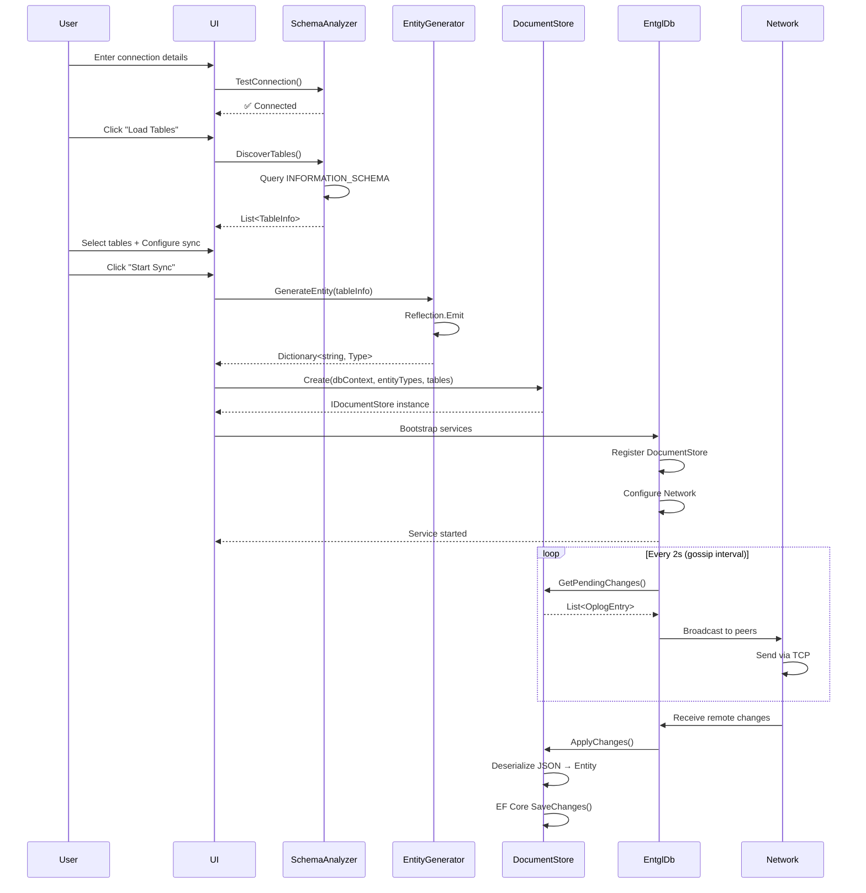

# Database Sync Manager con EntglDb.Net - Analisi Tecnica

## 📋 Panoramica del Progetto

Creazione di un **software generico di sincronizzazione database** che permette agli utenti di:

1. ✅ Connettersi a database esistenti (SQL Server, PostgreSQL, MySQL, SQLite)
2. ✅ Selezionare tabelle da sincronizzare tramite UI
3. ✅ Analizzare automaticamente schema e relazioni (FK, PK)
4. ✅ Generare mapping JSON ↔ Entità a runtime
5. ✅ Avviare sincronizzazione P2P senza scrivere codice

---

## 🏗️ Architettura del Sistema

```
┌─────────────────────────────────────────────────┐
│  EntglDb Sync Manager (Desktop App)             │
├─────────────────────────────────────────────────┤
│  1. Database Connection Manager                 │
│     - Connection string builder UI              │
│     - Test connection                           │
│     - Multi-provider support                    │
├─────────────────────────────────────────────────┤
│  2. Schema Discovery Engine                     │
│     - INFORMATION_SCHEMA queries                │
│     - EF Core metadata reader                   │
│     - FK/PK detection                           │
├─────────────────────────────────────────────────┤
│  3. Table Selection UI                          │
│     - Checkbox list con preview                 │
│     - Filtri per system tables                  │
│     - Stima dimensioni dati                     │
├─────────────────────────────────────────────────┤
│  4. Dynamic DocumentStore Generator             │
│     - Runtime entity generation                 │
│     - JSON serialization mapping                │
│     - Conflict resolution config                │
├─────────────────────────────────────────────────┤
│  5. Sync Configuration                          │
│     - Node ID, port, cluster key                │
│     - Known peers (IP:Port)                     │
│     - Conflict resolver (LWW/Merge)             │
├─────────────────────────────────────────────────┤
│  6. Real-Time Sync Monitor                      │
│     - Connected peers status                    │
│     - Oplog entries display                     │
│     - Network traffic stats                     │
└─────────────────────────────────────────────────┘
```

---

## 🔧 Componenti Tecnici Principali

### 1. Schema Discovery Engine

**Responsabilità:**
- Connessione a database esistenti
- Lettura metadati da `INFORMATION_SCHEMA`
- Rilevamento constraint (PK, FK, UNIQUE)
- Identificazione relazioni tra tabelle

**Implementazione:**

````csharp
// filepath: tools/EntglStudio/Services/DatabaseSchemaAnalyzer.cs
using Microsoft.EntityFrameworkCore;
using Microsoft.EntityFrameworkCore.Metadata;

public class DatabaseSchemaAnalyzer
{
    private readonly DbContext _context;
    
    public DatabaseSchemaAnalyzer(string connectionString, DatabaseProvider provider)
    {
        var optionsBuilder = new DbContextOptionsBuilder();
        
        switch (provider)
        {
            case DatabaseProvider.SqlServer:
                optionsBuilder.UseSqlServer(connectionString);
                break;
            case DatabaseProvider.PostgreSQL:
                optionsBuilder.UseNpgsql(connectionString);
                break;
            case DatabaseProvider.MySQL:
                optionsBuilder.UseMySql(connectionString, 
                    ServerVersion.AutoDetect(connectionString));
                break;
            case DatabaseProvider.SQLite:
                optionsBuilder.UseSqlite(connectionString);
                break;
        }
        
        _context = new DbContext(optionsBuilder.Options);
    }
    
    public async Task<List<TableInfo>> DiscoverTablesAsync()
    {
        var tables = new List<TableInfo>();
        
        // Query INFORMATION_SCHEMA o EF metadata
        var entityTypes = _context.Model.GetEntityTypes();
        
        foreach (var entityType in entityTypes)
        {
            var table = new TableInfo
            {
                Name = entityType.GetTableName(),
                Schema = entityType.GetSchema() ?? "dbo",
                Columns = GetColumns(entityType),
                PrimaryKey = GetPrimaryKey(entityType),
                ForeignKeys = GetForeignKeys(entityType),
                RowCount = await GetRowCountAsync(entityType.GetTableName())
            };
            
            tables.Add(table);
        }
        
        return tables;
    }
    
    private List<ColumnInfo> GetColumns(IEntityType entityType)
    {
        return entityType.GetProperties().Select(p => new ColumnInfo
        {
            Name = p.GetColumnName(),
            DataType = p.GetColumnType(),
            IsNullable = p.IsNullable,
            MaxLength = p.GetMaxLength(),
            ClrType = GetClrType(p)
        }).ToList();
    }
    
    private PrimaryKeyInfo GetPrimaryKey(IEntityType entityType)
    {
        var pk = entityType.FindPrimaryKey();
        return new PrimaryKeyInfo
        {
            ConstraintName = pk?.GetName(),
            Columns = pk?.Properties.Select(p => p.GetColumnName()).ToList() ?? new()
        };
    }
    
    private List<ForeignKeyInfo> GetForeignKeys(IEntityType entityType)
    {
        return entityType.GetForeignKeys().Select(fk => new ForeignKeyInfo
        {
            ConstraintName = fk.GetConstraintName(),
            ReferencedTable = fk.PrincipalEntityType.GetTableName(),
            Columns = fk.Properties.Select(p => p.GetColumnName()).ToList(),
            ReferencedColumns = fk.PrincipalKey.Properties
                .Select(p => p.GetColumnName()).ToList()
        }).ToList();
    }
    
    private async Task<long> GetRowCountAsync(string tableName)
    {
        var sql = $"SELECT COUNT(*) FROM {tableName}";
        return await _context.Database.ExecuteSqlRawAsync(sql);
    }
    
    private Type GetClrType(IProperty property)
    {
        var clrType = property.ClrType;
        return property.IsNullable && clrType.IsValueType
            ? typeof(Nullable<>).MakeGenericType(clrType)
            : clrType;
    }
}
````

**Modelli Dati:**

````csharp
// filepath: tools/EntglStudio/Models/SchemaModels.cs

public record TableInfo
{
    public string Name { get; init; }
    public string Schema { get; init; }
    public List<ColumnInfo> Columns { get; init; }
    public PrimaryKeyInfo PrimaryKey { get; init; }
    public List<ForeignKeyInfo> ForeignKeys { get; init; }
    public long RowCount { get; init; }
    public bool IsSelected { get; set; }
}

public record ColumnInfo
{
    public string Name { get; init; }
    public string DataType { get; init; }
    public bool IsNullable { get; init; }
    public int? MaxLength { get; init; }
    public Type ClrType { get; init; }
}

public record PrimaryKeyInfo
{
    public string ConstraintName { get; init; }
    public List<string> Columns { get; init; }
}

public record ForeignKeyInfo
{
    public string ConstraintName { get; init; }
    public string ReferencedTable { get; init; }
    public List<string> Columns { get; init; }
    public List<string> ReferencedColumns { get; init; }
}

public enum DatabaseProvider
{
    SqlServer,
    PostgreSQL,
    MySQL,
    SQLite
}
````

---

### 2. Dynamic Entity Generator

**Responsabilità:**
- Generazione classi C# runtime da schema SQL
- Creazione proprietà tipizzate
- Supporto nullable types
- Mapping SQL types → CLR types

**Implementazione:**

````csharp
// filepath: tools/EntglStudio/Services/DynamicEntityGenerator.cs
using System.Reflection;
using System.Reflection.Emit;

public class DynamicEntityGenerator
{
    private readonly ModuleBuilder _moduleBuilder;
    private readonly Dictionary<string, Type> _generatedTypes = new();
    
    public DynamicEntityGenerator()
    {
        var assemblyName = new AssemblyName("DynamicEntities");
        var assemblyBuilder = AssemblyBuilder.DefineDynamicAssembly(
            assemblyName, 
            AssemblyBuilderAccess.Run);
        _moduleBuilder = assemblyBuilder.DefineDynamicModule("MainModule");
    }
    
    public Type GenerateEntity(TableInfo table)
    {
        // Cache per evitare rigenerazione
        if (_generatedTypes.TryGetValue(table.Name, out var cachedType))
            return cachedType;
        
        var typeBuilder = _moduleBuilder.DefineType(
            $"Dynamic_{table.Name}",
            TypeAttributes.Public | TypeAttributes.Class);
        
        // Aggiungi proprietà per ogni colonna
        foreach (var column in table.Columns)
        {
            CreateProperty(typeBuilder, column);
        }
        
        var generatedType = typeBuilder.CreateType();
        _generatedTypes[table.Name] = generatedType;
        
        return generatedType;
    }
    
    private void CreateProperty(TypeBuilder typeBuilder, ColumnInfo column)
    {
        var propertyType = column.ClrType;
        var fieldBuilder = typeBuilder.DefineField(
            $"_{column.Name.ToLower()}", 
            propertyType, 
            FieldAttributes.Private);
        
        var propertyBuilder = typeBuilder.DefineProperty(
            column.Name,
            PropertyAttributes.HasDefault,
            propertyType,
            null);
        
        // Getter
        var getterBuilder = typeBuilder.DefineMethod(
            $"get_{column.Name}",
            MethodAttributes.Public | 
            MethodAttributes.SpecialName | 
            MethodAttributes.HideBySig,
            propertyType,
            Type.EmptyTypes);
        
        var getterIL = getterBuilder.GetILGenerator();
        getterIL.Emit(OpCodes.Ldarg_0);
        getterIL.Emit(OpCodes.Ldfld, fieldBuilder);
        getterIL.Emit(OpCodes.Ret);
        
        // Setter
        var setterBuilder = typeBuilder.DefineMethod(
            $"set_{column.Name}",
            MethodAttributes.Public | 
            MethodAttributes.SpecialName | 
            MethodAttributes.HideBySig,
            null,
            new[] { propertyType });
        
        var setterIL = setterBuilder.GetILGenerator();
        setterIL.Emit(OpCodes.Ldarg_0);
        setterIL.Emit(OpCodes.Ldarg_1);
        setterIL.Emit(OpCodes.Stfld, fieldBuilder);
        setterIL.Emit(OpCodes.Ret);
        
        propertyBuilder.SetGetMethod(getterBuilder);
        propertyBuilder.SetSetMethod(setterBuilder);
    }
    
    public Dictionary<string, Type> GetGeneratedTypes() => _generatedTypes;
}
````

---

### 3. Dynamic DocumentStore

**Responsabilità:**
- Implementazione `IDocumentStore` di EntglDb
- Mapping runtime SQL → JSON
- CRUD operations su tabelle selezionate
- Change tracking integration

**Implementazione:**

````csharp
// filepath: tools/EntglStudio/Services/DynamicEfCoreDocumentStore.cs
using EntglDb.Core.Storage;
using Microsoft.EntityFrameworkCore;
using System.Text.Json;

public class DynamicEfCoreDocumentStore : IDocumentStore
{
    private readonly DbContext _dbContext;
    private readonly Dictionary<string, Type> _entityTypes;
    private readonly Dictionary<string, TableInfo> _tableSchemas;
    
    public DynamicEfCoreDocumentStore(
        DbContext dbContext,
        Dictionary<string, Type> entityTypes,
        List<TableInfo> selectedTables)
    {
        _dbContext = dbContext;
        _entityTypes = entityTypes;
        _tableSchemas = selectedTables.ToDictionary(t => t.Name);
    }
    
    public async Task<Document?> GetAsync(
        string collection, 
        string key, 
        CancellationToken ct = default)
    {
        if (!_entityTypes.TryGetValue(collection, out var entityType))
            return null;
        
        var schema = _tableSchemas[collection];
        var pkColumn = schema.PrimaryKey.Columns.First();
        
        // Ottieni DbSet<T> dinamicamente
        var dbSet = GetDbSet(entityType);
        
        // Query dinamica con EF.Property
        var entity = await ((IQueryable<object>)dbSet)
            .FirstOrDefaultAsync(e => 
                EF.Property<string>(e, pkColumn) == key, ct);
        
        if (entity == null) return null;
        
        // Serializza a JSON
        var json = JsonSerializer.Serialize(entity, new JsonSerializerOptions
        {
            PropertyNamingPolicy = JsonNamingPolicy.CamelCase
        });
        
        return new Document
        {
            Collection = collection,
            Key = key,
            Content = JsonDocument.Parse(json).RootElement,
            Timestamp = HlcTimestamp.Now(_nodeId),
            IsDeleted = false
        };
    }
    
    public async Task PutAsync(Document document, CancellationToken ct = default)
    {
        if (!_entityTypes.TryGetValue(document.Collection, out var entityType))
            throw new InvalidOperationException($"Collection {document.Collection} not found");
        
        var schema = _tableSchemas[document.Collection];
        var pkColumn = schema.PrimaryKey.Columns.First();
        
        // Deserializza JSON → entity
        var entity = JsonSerializer.Deserialize(
            document.Content.GetRawText(), 
            entityType);
        
        if (entity == null)
            throw new InvalidOperationException("Failed to deserialize document");
        
        var dbSet = GetDbSet(entityType);
        var pkValue = entityType.GetProperty(pkColumn)?.GetValue(entity);
        
        // Verifica se esiste già
        var existing = await ((IQueryable<object>)dbSet)
            .FirstOrDefaultAsync(e => 
                EF.Property<object>(e, pkColumn).Equals(pkValue), ct);
        
        if (existing != null)
        {
            // Update
            _dbContext.Entry(existing).CurrentValues.SetValues(entity);
        }
        else
        {
            // Insert
            ((dynamic)dbSet).Add(entity);
        }
        
        await _dbContext.SaveChangesAsync(ct);
    }
    
    public async Task DeleteAsync(
        string collection, 
        string key, 
        CancellationToken ct = default)
    {
        if (!_entityTypes.TryGetValue(collection, out var entityType))
            return;
        
        var schema = _tableSchemas[collection];
        var pkColumn = schema.PrimaryKey.Columns.First();
        var dbSet = GetDbSet(entityType);
        
        var entity = await ((IQueryable<object>)dbSet)
            .FirstOrDefaultAsync(e => 
                EF.Property<string>(e, pkColumn) == key, ct);
        
        if (entity != null)
        {
            _dbContext.Remove(entity);
            await _dbContext.SaveChangesAsync(ct);
        }
    }
    
    private object GetDbSet(Type entityType)
    {
        return _dbContext.GetType()
            .GetMethod("Set", Type.EmptyTypes)
            ?.MakeGenericMethod(entityType)
            ?.Invoke(_dbContext, null)
            ?? throw new InvalidOperationException($"Cannot get DbSet for {entityType.Name}");
    }
    
    // Implementa altri metodi IDocumentStore...
    public Task<IAsyncEnumerable<Document>> ListAsync(
        string collection, 
        CancellationToken ct = default) 
        => throw new NotImplementedException();
    
    public Task<bool> ExistsAsync(
        string collection, 
        string key, 
        CancellationToken ct = default) 
        => throw new NotImplementedException();
}
````

---

### 4. Sync Configuration Manager

**Responsabilità:**
- Gestione configurazione nodi P2P
- Salvataggio/caricamento config da file
- Validazione impostazioni

**Implementazione:**

````csharp
// filepath: tools/EntglStudio/Services/SyncConfigurationManager.cs
using System.Text.Json;

public class SyncConfigurationManager
{
    private readonly string _configPath;
    
    public SyncConfigurationManager(string configPath = "sync-config.json")
    {
        _configPath = configPath;
    }
    
    public async Task<SyncConfiguration> LoadAsync()
    {
        if (!File.Exists(_configPath))
            return new SyncConfiguration();
        
        var json = await File.ReadAllTextAsync(_configPath);
        return JsonSerializer.Deserialize<SyncConfiguration>(json) 
            ?? new SyncConfiguration();
    }
    
    public async Task SaveAsync(SyncConfiguration config)
    {
        var json = JsonSerializer.Serialize(config, new JsonSerializerOptions
        {
            WriteIndented = true
        });
        
        await File.WriteAllTextAsync(_configPath, json);
    }
    
    public bool Validate(SyncConfiguration config, out List<string> errors)
    {
        errors = new List<string>();
        
        if (string.IsNullOrWhiteSpace(config.NodeId))
            errors.Add("Node ID is required");
        
        if (config.TcpPort < 1024 || config.TcpPort > 65535)
            errors.Add("TCP port must be between 1024 and 65535");
        
        if (string.IsNullOrWhiteSpace(config.ConnectionString))
            errors.Add("Connection string is required");
        
        if (!config.SelectedTables.Any())
            errors.Add("At least one table must be selected");
        
        return !errors.Any();
    }
}

public record SyncConfiguration
{
    public string NodeId { get; init; } = Environment.MachineName;
    public string ConnectionString { get; init; } = string.Empty;
    public DatabaseProvider Provider { get; init; } = DatabaseProvider.SqlServer;
    public List<string> SelectedTables { get; init; } = new();
    public int TcpPort { get; init; } = 5000;
    public int UdpPort { get; init; } = 5001;
    public string ClusterKey { get; init; } = "default-cluster";
    public List<PeerNode> KnownPeers { get; init; } = new();
    public ConflictResolutionStrategy ConflictStrategy { get; init; } 
        = ConflictResolutionStrategy.LastWriteWins;
}

public record PeerNode
{
    public string NodeId { get; init; }
    public string Address { get; init; } // IP:Port
}

public enum ConflictResolutionStrategy
{
    LastWriteWins,
    RecursiveMerge,
    Manual
}
````

---

### 5. Sync Engine Initialization

**Responsabilità:**
- Bootstrap EntglDb con configurazione runtime
- Registrazione servizi DI
- Avvio sync loop

**Implementazione:**

````csharp
// filepath: tools/EntglStudio/Services/SyncEngineBootstrapper.cs
using EntglDb.Core;
using EntglDb.Network;
using Microsoft.Extensions.DependencyInjection;

public class SyncEngineBootstrapper
{
    public async Task<IServiceProvider> InitializeAsync(
        SyncConfiguration config,
        Dictionary<string, Type> entityTypes,
        List<TableInfo> selectedTables)
    {
        var services = new ServiceCollection();
        
        // 1. Configura DbContext
        var dbContextOptions = CreateDbContextOptions(config);
        var dbContext = new DbContext(dbContextOptions);
        services.AddSingleton(dbContext);
        
        // 2. Crea DocumentStore dinamico
        var documentStore = new DynamicEfCoreDocumentStore(
            dbContext, 
            entityTypes, 
            selectedTables);
        services.AddSingleton<IDocumentStore>(documentStore);
        
        // 3. Registra EntglDb Core
        services.AddEntglDbCore(opts =>
        {
            opts.NodeId = config.NodeId;
            opts.ClusterKey = config.ClusterKey;
        });
        
        // 4. Registra EntglDb Network
        services.AddEntglDbNetwork(opts =>
        {
            opts.TcpPort = config.TcpPort;
            opts.UdpDiscoveryPort = config.UdpPort;
            opts.KnownPeers = config.KnownPeers
                .Select(p => new NetworkPeer 
                { 
                    NodeId = p.NodeId, 
                    Address = p.Address 
                })
                .ToList();
        });
        
        // 5. Configura conflict resolver
        switch (config.ConflictStrategy)
        {
            case ConflictResolutionStrategy.LastWriteWins:
                services.AddSingleton<IConflictResolver, LastWriteWinsConflictResolver>();
                break;
            case ConflictResolutionStrategy.RecursiveMerge:
                services.AddSingleton<IConflictResolver, RecursiveMergeConflictResolver>();
                break;
        }
        
        var serviceProvider = services.BuildServiceProvider();
        
        // 6. Avvia sync service
        var syncService = serviceProvider.GetRequiredService<ISyncService>();
        await syncService.StartAsync(CancellationToken.None);
        
        return serviceProvider;
    }
    
    private DbContextOptions CreateDbContextOptions(SyncConfiguration config)
    {
        var optionsBuilder = new DbContextOptionsBuilder();
        
        switch (config.Provider)
        {
            case DatabaseProvider.SqlServer:
                optionsBuilder.UseSqlServer(config.ConnectionString);
                break;
            case DatabaseProvider.PostgreSQL:
                optionsBuilder.UseNpgsql(config.ConnectionString);
                break;
            case DatabaseProvider.MySQL:
                optionsBuilder.UseMySql(config.ConnectionString, 
                    ServerVersion.AutoDetect(config.ConnectionString));
                break;
            case DatabaseProvider.SQLite:
                optionsBuilder.UseSqlite(config.ConnectionString);
                break;
        }
        
        return optionsBuilder.Options;
    }
}
````

---

## 🖥️ User Interface (Avalonia UI)

### Main Window Layout

````xml
<!-- filepath: tools/EntglStudio/Views/MainWindow.axaml -->
<Window xmlns="https://github.com/avaloniaui"
        xmlns:x="http://schemas.microsoft.com/winfx/2006/xaml"
        xmlns:vm="using:EntglStudio.ViewModels"
        x:Class="EntglStudio.Views.MainWindow"
        Title="EntglDb Sync Manager"
        Width="1200" Height="800">
    
    <Design.DataContext>
        <vm:MainWindowViewModel/>
    </Design.DataContext>
    
    <Grid ColumnDefinitions="200,*">
        <!-- Sidebar Navigation -->
        <StackPanel Grid.Column="0" Background="#2d2d30">
            <Button Content="🔌 Connection" 
                    Command="{Binding NavigateToConnectionCommand}"
                    Classes="nav-button"/>
            <Button Content="📋 Tables" 
                    Command="{Binding NavigateToTablesCommand}"
                    Classes="nav-button"/>
            <Button Content="⚙️ Configuration" 
                    Command="{Binding NavigateToConfigCommand}"
                    Classes="nav-button"/>
            <Button Content="🔄 Sync Monitor" 
                    Command="{Binding NavigateToMonitorCommand}"
                    Classes="nav-button"/>
        </StackPanel>
        
        <!-- Content Area -->
        <ContentControl Grid.Column="1" 
                        Content="{Binding CurrentView}"/>
    </Grid>
</Window>
````

### Connection Setup View

````xml
<!-- filepath: tools/EntglStudio/Views/ConnectionSetupView.axaml -->
<UserControl xmlns="https://github.com/avaloniaui">
    <StackPanel Spacing="15" Margin="30">
        <TextBlock Text="Database Connection" 
                   FontSize="28" 
                   FontWeight="Bold"/>
        
        <ComboBox Header="Database Provider"
                  ItemsSource="{Binding Providers}"
                  SelectedItem="{Binding SelectedProvider}"/>
        
        <TextBox Header="Server" 
                 Text="{Binding ServerAddress}"
                 Watermark="localhost"/>
        
        <TextBox Header="Database Name" 
                 Text="{Binding DatabaseName}"/>
        
        <TextBox Header="Username" 
                 Text="{Binding Username}"/>
        
        <TextBox Header="Password" 
                 Text="{Binding Password}"
                 PasswordChar="●"/>
        
        <StackPanel Orientation="Horizontal" Spacing="10">
            <Button Content="Test Connection" 
                    Command="{Binding TestConnectionCommand}"/>
            <Button Content="Load Tables" 
                    Command="{Binding LoadTablesCommand}"
                    IsEnabled="{Binding IsConnected}"/>
        </StackPanel>
        
        <TextBlock Text="{Binding StatusMessage}" 
                   Foreground="{Binding StatusColor}"/>
    </StackPanel>
</UserControl>
````

### Table Selection View

````xml
<!-- filepath: tools/EntglStudio/Views/TableSelectionView.axaml -->
<UserControl xmlns="https://github.com/avaloniaui">
    <Grid RowDefinitions="Auto,*,Auto">
        <StackPanel Grid.Row="0" Margin="20">
            <TextBlock Text="Select Tables to Sync" 
                       FontSize="24" 
                       FontWeight="Bold"/>
            <TextBlock Text="{Binding SelectedCount}" 
                       Margin="0,5,0,0"/>
        </StackPanel>
        
        <DataGrid Grid.Row="1"
                  ItemsSource="{Binding Tables}"
                  AutoGenerateColumns="False"
                  IsReadOnly="False"
                  CanUserReorderColumns="True">
            <DataGrid.Columns>
                <DataGridCheckBoxColumn Header="Sync" 
                                       Binding="{Binding IsSelected}"/>
                <DataGridTextColumn Header="Table Name" 
                                   Binding="{Binding Name}"
                                   Width="*"/>
                <DataGridTextColumn Header="Schema" 
                                   Binding="{Binding Schema}"
                                   Width="100"/>
                <DataGridTextColumn Header="Rows" 
                                   Binding="{Binding RowCount}"
                                   Width="100"/>
                <DataGridTextColumn Header="Primary Key" 
                                   Binding="{Binding PrimaryKey.Columns[0]}"
                                   Width="150"/>
            </DataGrid.Columns>
        </DataGrid>
        
        <StackPanel Grid.Row="2" 
                    Orientation="Horizontal" 
                    HorizontalAlignment="Right"
                    Margin="20">
            <Button Content="Previous" 
                    Command="{Binding PreviousCommand}"/>
            <Button Content="Next" 
                    Command="{Binding NextCommand}"
                    Margin="10,0,0,0"/>
        </StackPanel>
    </Grid>
</UserControl>
````

### Sync Monitor View

````xml
<!-- filepath: tools/EntglStudio/Views/SyncMonitorView.axaml -->
<UserControl xmlns="https://github.com/avaloniaui">
    <Grid ColumnDefinitions="300,*" RowDefinitions="*">
        <!-- Peers Panel -->
        <StackPanel Grid.Column="0" Margin="10">
            <TextBlock Text="Connected Peers" 
                       FontSize="18" 
                       FontWeight="Bold"
                       Margin="0,0,0,10"/>
            
            <ListBox ItemsSource="{Binding Peers}">
                <ListBox.ItemTemplate>
                    <DataTemplate>
                        <StackPanel Orientation="Horizontal" Spacing="10">
                            <Ellipse Width="12" 
                                    Height="12" 
                                    Fill="{Binding StatusColor}"/>
                            <StackPanel>
                                <TextBlock Text="{Binding NodeId}" 
                                          FontWeight="SemiBold"/>
                                <TextBlock Text="{Binding Address}" 
                                          FontSize="11" 
                                          Foreground="Gray"/>
                                <TextBlock Text="{Binding Latency}" 
                                          FontSize="10" 
                                          Foreground="Gray"/>
                            </StackPanel>
                        </StackPanel>
                    </DataTemplate>
                </ListBox.ItemTemplate>
            </ListBox>
        </StackPanel>
        
        <!-- Sync Activity -->
        <Grid Grid.Column="1" RowDefinitions="Auto,*,Auto">
            <StackPanel Grid.Row="0" Margin="10">
                <TextBlock Text="Sync Activity" 
                           FontSize="18" 
                           FontWeight="Bold"/>
                <TextBlock Text="{Binding SyncStatus}" 
                           Margin="0,5,0,0"/>
            </StackPanel>
            
            <DataGrid Grid.Row="1"
                      ItemsSource="{Binding SyncEvents}"
                      AutoGenerateColumns="False"
                      IsReadOnly="True">
                <DataGrid.Columns>
                    <DataGridTextColumn Header="Time" 
                                       Binding="{Binding Timestamp}"
                                       Width="150"/>
                    <DataGridTextColumn Header="Collection" 
                                       Binding="{Binding Collection}"
                                       Width="150"/>
                    <DataGridTextColumn Header="Operation" 
                                       Binding="{Binding Operation}"
                                       Width="100"/>
                    <DataGridTextColumn Header="Key" 
                                       Binding="{Binding Key}"
                                       Width="200"/>
                    <DataGridTextColumn Header="Peer" 
                                       Binding="{Binding PeerId}"
                                       Width="*"/>
                </DataGrid.Columns>
            </DataGrid>
            
            <StackPanel Grid.Row="2" 
                        Orientation="Horizontal" 
                        Margin="10"
                        Spacing="20">
                <TextBlock>
                    <Run Text="Total Synced: "/>
                    <Run Text="{Binding TotalSyncedItems}" 
                         FontWeight="Bold"/>
                </TextBlock>
                <TextBlock>
                    <Run Text="Pending: "/>
                    <Run Text="{Binding PendingItems}" 
                         FontWeight="Bold"/>
                </TextBlock>
                <Button Content="🔄 Force Sync" 
                        Command="{Binding ForceSyncCommand}"/>
            </StackPanel>
        </Grid>
    </Grid>
</UserControl>
````

---

## 📊 ViewModels

### Main Window ViewModel

````csharp
// filepath: tools/EntglStudio/ViewModels/MainWindowViewModel.cs
using CommunityToolkit.Mvvm.ComponentModel;
using CommunityToolkit.Mvvm.Input;

public partial class MainWindowViewModel : ViewModelBase
{
    [ObservableProperty]
    private ViewModelBase _currentView;
    
    private readonly ConnectionSetupViewModel _connectionViewModel;
    private readonly TableSelectionViewModel _tableSelectionViewModel;
    private readonly SyncConfigurationViewModel _configViewModel;
    private readonly SyncMonitorViewModel _monitorViewModel;
    
    public MainWindowViewModel()
    {
        _connectionViewModel = new ConnectionSetupViewModel();
        _tableSelectionViewModel = new TableSelectionViewModel();
        _configViewModel = new SyncConfigurationViewModel();
        _monitorViewModel = new SyncMonitorViewModel();
        
        // Navigate to connection on startup
        _currentView = _connectionViewModel;
    }
    
    [RelayCommand]
    private void NavigateToConnection() => CurrentView = _connectionViewModel;
    
    [RelayCommand]
    private void NavigateToTables() => CurrentView = _tableSelectionViewModel;
    
    [RelayCommand]
    private void NavigateToConfig() => CurrentView = _configViewModel;
    
    [RelayCommand]
    private void NavigateToMonitor() => CurrentView = _monitorViewModel;
}
````

### Connection Setup ViewModel

````csharp
// filepath: tools/EntglStudio/ViewModels/ConnectionSetupViewModel.cs
using CommunityToolkit.Mvvm.ComponentModel;
using CommunityToolkit.Mvvm.Input;

public partial class ConnectionSetupViewModel : ViewModelBase
{
    [ObservableProperty]
    private List<DatabaseProvider> _providers = Enum.GetValues<DatabaseProvider>().ToList();
    
    [ObservableProperty]
    private DatabaseProvider _selectedProvider = DatabaseProvider.SqlServer;
    
    [ObservableProperty]
    private string _serverAddress = "localhost";
    
    [ObservableProperty]
    private string _databaseName = string.Empty;
    
    [ObservableProperty]
    private string _username = string.Empty;
    
    [ObservableProperty]
    private string _password = string.Empty;
    
    [ObservableProperty]
    private bool _isConnected;
    
    [ObservableProperty]
    private string _statusMessage = string.Empty;
    
    [ObservableProperty]
    private string _statusColor = "Gray";
    
    private DatabaseSchemaAnalyzer? _analyzer;
    
    [RelayCommand]
    private async Task TestConnection()
    {
        try
        {
            StatusMessage = "Testing connection...";
            StatusColor = "Orange";
            
            var connectionString = BuildConnectionString();
            _analyzer = new DatabaseSchemaAnalyzer(connectionString, SelectedProvider);
            
            // Test with simple query
            await _analyzer.TestConnectionAsync();
            
            IsConnected = true;
            StatusMessage = "✅ Connection successful!";
            StatusColor = "Green";
        }
        catch (Exception ex)
        {
            IsConnected = false;
            StatusMessage = $"❌ Error: {ex.Message}";
            StatusColor = "Red";
        }
    }
    
    [RelayCommand]
    private async Task LoadTables()
    {
        if (_analyzer == null) return;
        
        try
        {
            var tables = await _analyzer.DiscoverTablesAsync();
            
            // Pass to table selection viewmodel
            // Implement navigation logic here
        }
        catch (Exception ex)
        {
            StatusMessage = $"❌ Error loading tables: {ex.Message}";
            StatusColor = "Red";
        }
    }
    
    private string BuildConnectionString()
    {
        return SelectedProvider switch
        {
            DatabaseProvider.SqlServer => 
                $"Server={ServerAddress};Database={DatabaseName};User Id={Username};Password={Password};TrustServerCertificate=True;",
            DatabaseProvider.PostgreSQL => 
                $"Host={ServerAddress};Database={DatabaseName};Username={Username};Password={Password};",
            DatabaseProvider.MySQL => 
                $"Server={ServerAddress};Database={DatabaseName};Uid={Username};Pwd={Password};",
            DatabaseProvider.SQLite => 
                $"Data Source={DatabaseName}",
            _ => throw new NotSupportedException($"Provider {SelectedProvider} not supported")
        };
    }
}
````

---

## 🔄 Flusso Completo Operativo



---

## 🛠️ Stack Tecnologico Consigliato

| Componente | Libreria/Framework | Versione | Note |
|------------|-------------------|----------|------|
| **UI Framework** | Avalonia UI | 11.x | Cross-platform (Windows/Mac/Linux) |
| **MVVM Toolkit** | CommunityToolkit.Mvvm | 8.x | Source generators per MVVM |
| **Database Access** | Entity Framework Core | 8.x | Multi-provider support |
| **Schema Discovery** | EF Core Design | 8.x | Metadata API |
| **Dynamic Code Gen** | System.Reflection.Emit | Built-in | Runtime type generation |
| **JSON Serialization** | System.Text.Json | Built-in | High performance |
| **Logging** | Serilog | 3.x | Structured logging |
| **Configuration** | Microsoft.Extensions.Configuration | 8.x | appsettings.json |
| **DI Container** | Microsoft.Extensions.DependencyInjection | 8.x | Standard DI |
| **Network** | EntglDb.Network | Latest | Built-in P2P sync |

---

## 📝 Configurazione Salvata (Esempio)

````json
{
  "nodeId": "store-001",
  "connectionString": "Server=localhost;Database=StoreDb;User Id=sa;Password=***;TrustServerCertificate=True",
  "provider": "SqlServer",
  "selectedTables": [
    {
      "name": "Products",
      "schema": "dbo",
      "primaryKey": ["ProductId"],
      "syncDirection": "bidirectional"
    },
    {
      "name": "Orders",
      "schema": "dbo",
      "primaryKey": ["OrderId"],
      "syncDirection": "pull-only"
    },
    {
      "name": "Customers",
      "schema": "dbo",
      "primaryKey": ["CustomerId"],
      "syncDirection": "bidirectional"
    }
  ],
  "entglDbConfig": {
    "tcpPort": 5000,
    "udpPort": 5001,
    "clusterKey": "retail-cluster-2024",
    "knownPeers": [
      {
        "nodeId": "central-server",
        "address": "10.0.0.1:5000"
      },
      {
        "nodeId": "store-002",
        "address": "10.0.0.2:5000"
      }
    ],
    "conflictStrategy": "LastWriteWins",
    "compressionEnabled": true,
    "encryptionEnabled": true
  }
}
````

---

## 🎯 Roadmap Sviluppo

### Phase 1: MVP (4-6 settimane)
- [ ] UI base con Avalonia
- [ ] Schema discovery per SQL Server
- [ ] Dynamic entity generation
- [ ] Basic sync (INSERT/UPDATE)
- [ ] Configuration persistence

### Phase 2: Multi-Provider (2-3 settimane)
- [ ] PostgreSQL support
- [ ] MySQL support
- [ ] SQLite support
- [ ] Provider-specific optimizations

### Phase 3: Advanced Features (3-4 settimane)
- [ ] DELETE handling (tombstones)
- [ ] Conflict resolution UI
- [ ] Real-time monitoring dashboard
- [ ] Performance metrics
- [ ] Log viewer

### Phase 4: Enterprise Features (4-6 settimane)
- [ ] Authentication/authorization
- [ ] Role-based sync (table-level permissions)
- [ ] Schema migration handling
- [ ] Backup/restore
- [ ] Multi-tenant support

### Phase 5: Deployment (2 settimane)
- [ ] Installer (Windows MSI)
- [ ] Docker image
- [ ] Documentation
- [ ] Video tutorials

---

## ⚠️ Considerazioni Importanti

### Limitazioni del Approach
1. **Schema Changes**: Modifiche allo schema durante sync richiedono restart
2. **Large Objects**: Tabelle con BLOB/CLOB potrebbero essere problematiche
3. **Complex Relationships**: FK circolari richiedono attenzione speciale
4. **Performance**: Reflection.Emit ha overhead iniziale (cache necessaria)

### Best Practices
1. **Testing**: Testare con database di dimensioni reali (Northwind, AdventureWorks)
2. **Monitoring**: Implementare logging dettagliato per debugging
3. **Backup**: Sempre consigliare backup prima di attivare sync
4. **Versioning**: Usare schema versioning per migration safety
5. **Security**: Abilitare encryption per production

### Alternative Approaches
- **Source Generators**: Invece di Reflection.Emit, considerare Roslyn source generators
- **EF Core Interceptors**: Per change tracking più integrato
- **Change Data Capture**: SQL Server CDC per tracking nativo

---

## 📚 Riferimenti EntglDb.Net

- **Core**: `src/EntglDb.Core/README.md`
- **Network**: `src/EntglDb.Network/README.md`
- **EF Provider**: `src/EntglDb.Persistence.EntityFramework/README.md`
- **Samples**: `samples/README.md`
- **Quick Start**: `README.md#quick-start`

---

## ✅ Conclusione

Questo design fornisce una **soluzione completa e user-friendly** per sincronizzare database SQL esistenti usando EntglDb.Net come motore di sync P2P.

**Punti di Forza:**
- ✅ Nessuna modifica al database esistente richiesta
- ✅ UI intuitiva per utenti non tecnici
- ✅ Multi-provider support (SQL Server, PostgreSQL, MySQL, SQLite)
- ✅ Runtime discovery e mapping automatico
- ✅ Sync P2P robusto con EntglDb

**Next Steps:**
1. Creare progetto Avalonia da template
2. Implementare `DatabaseSchemaAnalyzer`
3. Testare dynamic entity generation
4. Integrare con EntglDb Core
5. Build UI progressivamente

**Domande da risolvere durante sviluppo:**
- Gestione composite primary keys
- Handling di trigger esistenti sul database
- Performance con tabelle grandi (>1M rows)
- Schema evolution strategy

---

*Documento creato: 19 Febbraio 2026*  
*Versione: 1.0*  
*Autore: Analisi tecnica per EntglDb.Net Database Sync Manager*
